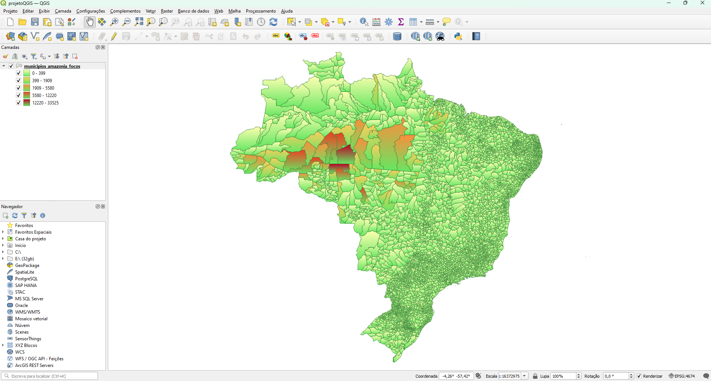

# Análise Espacial de Focos de Queimadas na Amazônia com Python


## 📝 Descrição do Projeto

Desenvolvi este projeto como parte dos meus estudos em Python para análise de dados, com o objetivo de aplicar na prática a manipulação de dados geoespaciais e transformar dados brutos em uma visualização de impacto.

O script automatiza a análise de dados públicos de focos de queimadas do INPE para identificar os municípios do bioma Amazônico com a maior incidência de queimadas. Utilizando Python e a biblioteca GeoPandas, o projeto realiza um processo completo de ETL (Extração, Transformação e Carga) e análise espacial.

---

## 🗺️ Resultado Final



*O mapa acima demonstra a concentração de focos de queimada para o mês de agosto de 2025, destacando em vermelho os municípios com maior incidência na região amazônica.*

### Principais Resultados

A análise para o mês de agosto de 2025 identificou os seguintes municípios como os de maior incidência de focos de queimada:

```
      NM_MUN      T_focos
135   Colniza     33525
31    Apuí        23088
232   Lábrea      12220
293   Novo Aripuanã 11153
41    Aripuanã    10941
```

---

## 🛠️ Tecnologias Utilizadas

* **Linguagem:** Python 3.10
* **Bibliotecas Principais:**
    * **GeoPandas:** Para manipulação e análise de dados geoespaciais.
    * **Pandas:** Para a estruturação, agregação e limpeza dos dados.
* **Ambiente:** Gerenciador de pacotes Conda.
* **Validação Visual:** QGIS.

---

## 📁 Como Executar o Projeto

**1. Fontes de Dados**

Os dados brutos não estão incluídos neste repositório. Para executar o projeto, é necessário fazer o download das seguintes fontes e colocá-los na pasta `dados_originais/`:

* **Focos de Queimadas:** Arquivo CSV mensal (utilizado o de Agosto/2025) obtido do [Programa Queimadas do INPE](https://queimadas.dgi.inpe.br/queimadas/bdqueimadas/).
* **Limites Municipais:** Shapefile da "Malha Municipal 2022" obtido do [IBGE](https://geoftp.ibge.gov.br/organizacao_do_territorio/malhas_territoriais/malhas_municipais/municipio_2022/Brasil/BR/BR_Municipios_2022.zip).
* **Biomas do Brasil:** Shapefile dos "Biomas na escala 1:250.000" obtido do [IBGE](https://www.ibge.gov.br/geociencias/cartas-e-mapas/informacoes-ambientais/15842-biomas.html?=&t=downloads).

**2. Configuração do Ambiente**

```bash
# Crie o ambiente Conda com as bibliotecas necessárias
conda create -n geo_env -c conda-forge python=3.10 geopandas

# Ative o ambiente recém-criado
conda activate geo_env
```

**3. Execução do Script**

Com o ambiente ativado e os arquivos de dados na pasta correta, execute o script principal a partir do terminal:

```bash
python analise_queimadas.py
```

---
## 📊 Dados de Saída

O script principal gera um arquivo Shapefile completo (`municipios_amazonia_focos.shp`) com os dados para todos os 5570 municípios do Brasil. Devido ao seu tamanho (>250MB), **este arquivo é ignorado pelo Git** e não está incluído no repositório.

Uma amostra dos resultados, contendo apenas os municípios com focos de queimada e suas contagens, é gerada e pode ser encontrada no arquivo [resultado_contagem_focos.csv](dados_processados/resultado_contagem_focos.csv).

---

## 🧠 Desafios e Aprendizados

Durante este projeto, enfrentei alguns desafios que foram cruciais para o meu aprendizado:

* **Manipulação de CRS:** Um dos maiores aprendizados foi a importância de trabalhar com Sistemas de Referência de Coordenadas (CRS) e a necessidade de garantir que todas as camadas estivessem padronizadas para que a análise espacial funcionasse corretamente.
* **Limpeza e Formatação de Dados:** Lidei com `KeyErrors` ao investigar os nomes corretos das colunas nos dados do IBGE e percebi a importancia converter tipos de dados  diretamente no Python para garantir a visualização e análise correta dos dados que é realizada posteriormente no softwares GIS.
* **Limitações de Formatos:** Ao trabalhar com Shapefiles, percebi na prática suas limitações, como a restrição de apenas 10 caracteres para os nomes das colunas e a fragmentação em vários arquivos, o que me fez compreender a relevância de formatos mais modernos, como o GeoPackage.
